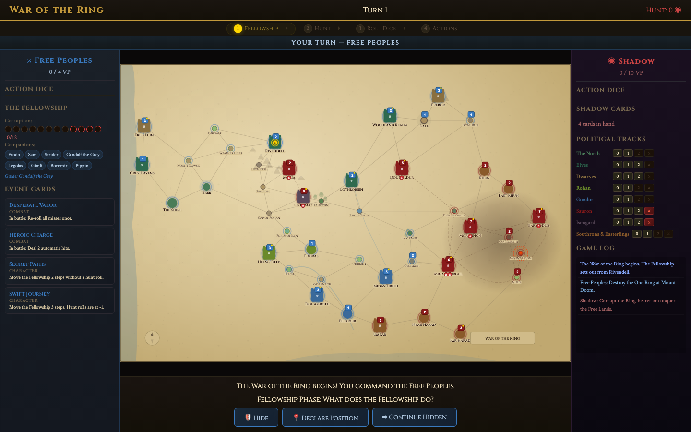
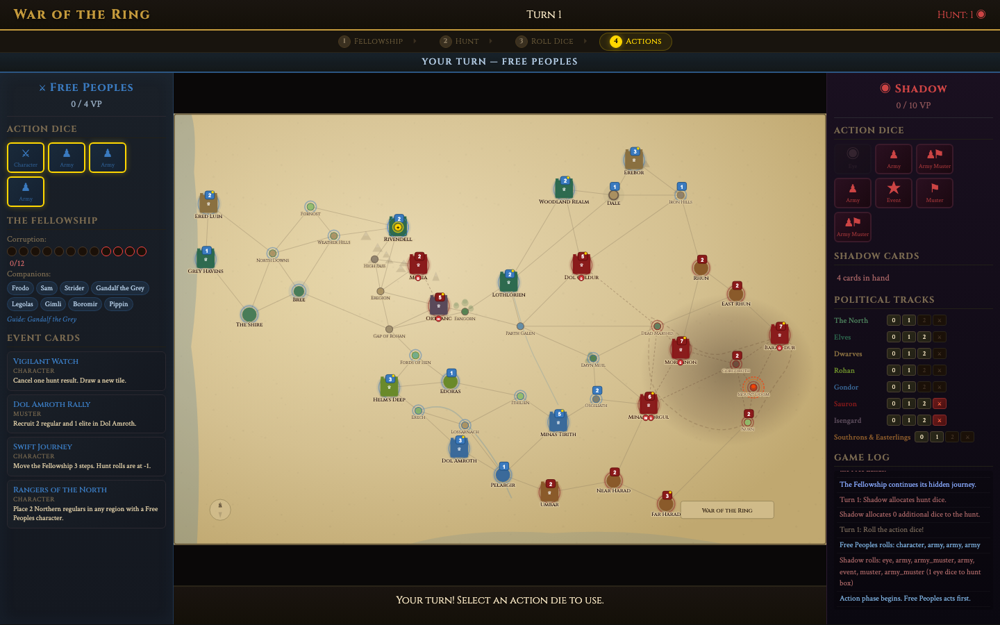

# War of the Ring

A digital adaptation of the classic asymmetric strategy board game, playable in your browser. The Free Peoples defend Middle-earth and guide the Fellowship to Mount Doom, while the Shadow player musters armies and hunts the Ring-bearer. Single-player vs AI. No dependencies.



## Features

- **Asymmetric factions** -- Free Peoples (4 dice, secret quest) vs Shadow (7 dice, military might)
- **Action dice system** -- Roll dice each turn to determine available actions: move armies, recruit, advance politics, play events, or guide the Fellowship
- **Hidden movement** -- The Fellowship moves secretly across Middle-earth while the Shadow hunts for the Ring
- **44 regions, 78 routes** -- A parchment-style map of Middle-earth with mountains, rivers, forests, and the shadow lands of Mordor
- **8 nations with political tracks** -- Nations must be rallied to war before they can muster troops
- **Combat** -- Regulars, elites, and leaders clash with dice; strongholds grant siege defense
- **40 event cards** -- 20 per side, with strategic and combat effects
- **3 victory conditions** -- Destroy the Ring, corrupt the Ring-bearer, or conquer enough settlements
- **AI opponent** -- Plays the Shadow with army movement, mustering, and political strategy
- **Clear turn flow** -- Phase stepper, active player banner, and step-by-step guidance



## Play

Serve the files locally and open in any modern browser:

```bash
python3 -m http.server 8080
# open http://localhost:8080
```

No build step. No `npm install`. Works from a static file server or directly from disk.

## How It Works

Each turn follows four phases:

1. **Fellowship** -- Choose whether to hide, reveal, or continue the secret journey toward Mount Doom
2. **Hunt** -- The Shadow allocates dice to search for the Fellowship
3. **Dice Roll** -- Both sides roll action dice (Shadow "Eye" results go to the hunt pool)
4. **Actions** -- Players alternate spending dice on army moves, mustering, politics, events, or guiding the Fellowship

The Free Peoples win by moving the Fellowship to Mount Doom before corruption reaches 12, or by capturing 4 VP of enemy settlements. The Shadow wins by corrupting the Ring-bearer or capturing 10 VP of Free Peoples settlements.

Hover over any region for a tooltip showing its garrison, nation, settlement type, and VP value.

## Architecture

```
index.html          -- Game layout with phase stepper and active player banner
css/style.css       -- Visual theme with Free Peoples (blue) / Shadow (red) colors
js/data.js          -- Nations, regions, characters, cards, and game constants
js/engine.js        -- Core game state, rules, and phase management
js/renderer.js      -- SVG map rendering, dice display, and UI panel updates
js/ui.js            -- User interaction handling and game flow
js/ai.js            -- Shadow AI opponent logic
js/main.js          -- Game initialization
```

## Contributing

Contributions are welcome:

- **Gameplay** -- Balance tuning, AI improvements, additional event cards
- **Art** -- Better map terrain, unit icons, card illustrations
- **Features** -- Multiplayer, undo/redo, save/load, campaign scenarios

## License

MIT
